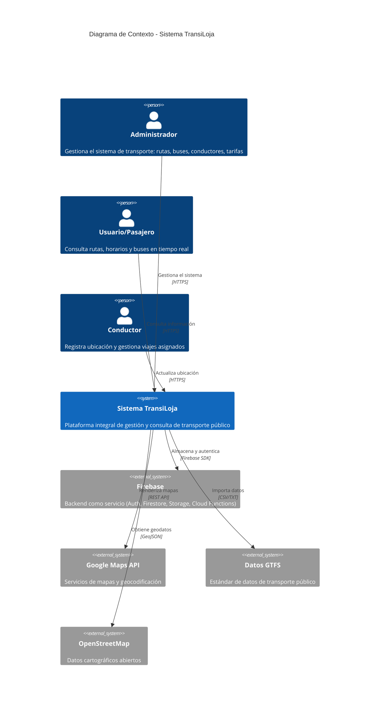
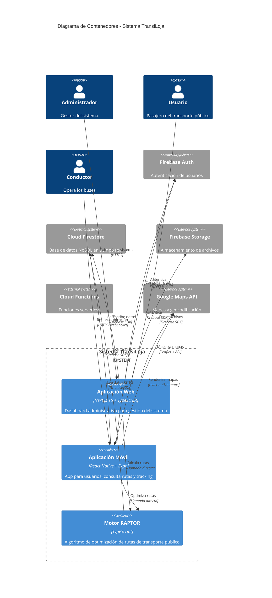
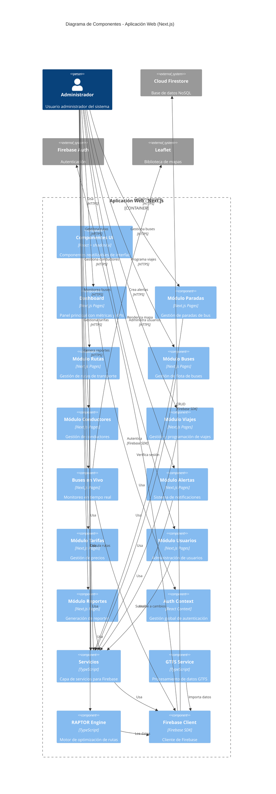

# Diagramas C4 - Sistema TransiLoja

Este documento presenta los diagramas C4 del **Sistema de Transporte Público de Loja (TransiLoja)**, una solución tecnológica integral para la gestión y consulta del transporte urbano.

---

## Nivel 1: Diagrama de Contexto del Sistema

El diagrama de contexto muestra el sistema TransiLoja y cómo interactúa con usuarios y sistemas externos.

---

## Nivel 2: Diagrama de Contenedores

El diagrama de contenedores muestra los principales componentes técnicos del sistema TransiLoja.

---

## Nivel 3A: Diagrama de Componentes - Aplicación Web

Este diagrama muestra los componentes internos de la aplicación web administrativa.

---

## Nivel 3B: Diagrama de Componentes - Aplicación Móvil

Este diagrama muestra los componentes internos de la aplicación móvil para usuarios.

```mermaid
C4Component
    title Diagrama de Componentes - Aplicación Móvil (Expo/React Native)

    Person(user, "Usuario", "Pasajero del transporte público")
    Person(driver, "Conductor", "Conductor de bus")

    Container_Boundary(mobile, "Aplicación Móvil - React Native") {
        Component(home, "Pantalla Home", "React Native Screen", "Mapa principal con buses en vivo")
        Component(route_planner, "Planificador de Rutas", "React Native Screen", "Búsqueda y optimización de rutas")
        Component(stops, "Paradas Cercanas", "React Native Screen", "Búsqueda de paradas por ubicación")
        Component(alerts_screen, "Alertas", "React Native Screen", "Notificaciones del sistema")
        Component(profile, "Perfil", "React Native Screen", "Gestión de cuenta y preferencias")
        Component(driver_tracking, "Tracking Conductor", "React Native Screen", "Módulo para conductores")
        Component(buses_list, "Lista de Buses", "React Native Screen", "Visualización de buses disponibles")
        Component(route_detail, "Detalle de Ruta", "React Native Screen", "Información detallada de ruta")

        Component(auth_context, "AuthContext", "React Context", "Estado global de autenticación")
        Component(user_context, "UserContext", "React Context", "Estado global de usuario")
        Component(location_hook, "useLocation", "Custom Hook", "Gestión de geolocalización")
        Component(firebase_hook, "useFirebase", "Custom Hook", "Operaciones Firebase")

        Component(raptor_lib, "RAPTOR Library", "TypeScript", "Cliente del algoritmo RAPTOR")
        Component(maps_component, "Maps Component", "react-native-maps", "Componente de mapa nativo")
        Component(notification_service, "Notification Service", "Expo Notifications", "Servicio de notificaciones push")
        Component(firebase_mobile, "Firebase Client", "Firebase SDK", "Cliente Firebase móvil")
    }

    System_Ext(firestore_mobile, "Cloud Firestore", "Base de datos en tiempo real")
    System_Ext(firebase_auth_mobile, "Firebase Auth", "Autenticación móvil")
    System_Ext(firebase_storage, "Firebase Storage", "Almacenamiento de archivos")
    System_Ext(google_maps, "Google Maps SDK", "SDK de mapas nativos")
    System_Ext(expo_location, "Expo Location", "API de geolocalización")

    Rel(user, home, "Ve buses", "Touch")
    Rel(user, route_planner, "Planifica viaje", "Touch")
    Rel(user, stops, "Busca paradas", "Touch")
    Rel(user, alerts_screen, "Lee alertas", "Touch")
    Rel(user, profile, "Gestiona perfil", "Touch")
    Rel(driver, driver_tracking, "Reporta ubicación", "Touch")

    Rel(home, maps_component, "Muestra mapa")
    Rel(home, firebase_mobile, "Suscribe a buses")
    Rel(home, location_hook, "Obtiene ubicación")

    Rel(route_planner, raptor_lib, "Calcula ruta óptima")
    Rel(route_planner, firebase_hook, "Lee datos")
    Rel(route_planner, maps_component, "Muestra ruta")

    Rel(stops, location_hook, "Obtiene ubicación")
    Rel(stops, firebase_hook, "Busca paradas")
    Rel(stops, maps_component, "Muestra paradas")

    Rel(alerts_screen, notification_service, "Muestra notificaciones")
    Rel(alerts_screen, firebase_hook, "Lee alertas")

    Rel(profile, auth_context, "Gestiona sesión")
    Rel(profile, user_context, "Lee/actualiza datos")

    Rel(driver_tracking, location_hook, "Obtiene ubicación GPS")
    Rel(driver_tracking, firebase_mobile, "Actualiza posición")

    Rel(auth_context, firebase_mobile, "Autentica")
    Rel(user_context, firebase_mobile, "Gestiona datos")
    Rel(location_hook, expo_location, "Usa API")
    Rel(firebase_hook, firebase_mobile, "Delega operaciones")

    Rel(maps_component, google_maps, "Renderiza", "Native SDK")
    Rel(firebase_mobile, firestore_mobile, "CRUD + Realtime", "Firebase SDK")
    Rel(firebase_mobile, firebase_auth_mobile, "Autentica", "Firebase SDK")
    Rel(firebase_mobile, firebase_storage, "Descarga archivos", "Firebase SDK")
    Rel(raptor_lib, firestore_mobile, "Lee datos GTFS", "Firebase SDK")

    UpdateLayoutConfig($c4ShapeInRow="4", $c4BoundaryInRow="1")
```

---

## Modelo de Datos Principal

El sistema utiliza los siguientes modelos de datos en Firestore:

### Colecciones Principales

| Colección | Descripción | Campos Principales |
|-----------|-------------|-------------------|
| `rutas` | Rutas de transporte | `codigo`, `nombre`, `color`, `tipo`, `paradas[]` |
| `paradas` | Paradas de bus | `codigo`, `nombre`, `ubicacion`, `descripcion` |
| `buses` | Flota de buses | `numero`, `placa`, `capacidad`, `estado`, `conductorId` |
| `conductores` | Conductores | `nombre`, `cedula`, `licencia`, `telefono` |
| `viajes` | Viajes programados | `rutaId`, `busId`, `conductorId`, `horarios[]` |
| `tarifas` | Tarifas del sistema | `tipo`, `precio`, `descripcion`, `vigencia` |
| `alertas` | Notificaciones | `titulo`, `mensaje`, `tipo`, `fecha`, `activa` |
| `usuarios` | Usuarios del sistema | `email`, `rol`, `nombre`, `preferencias` |
| `tracking` | Posiciones en vivo | `busId`, `ubicacion`, `timestamp`, `velocidad` |

### Datos GTFS Importados

| Entidad | Descripción |
|---------|-------------|
| `routes` | Rutas GTFS estándar |
| `stops` | Paradas GTFS estándar |
| `trips` | Viajes GTFS estándar |
| `stop_times` | Horarios de paradas |
| `calendar` | Calendarios de servicio |
| `shapes` | Geometrías de rutas |

---

## Flujos Principales del Sistema

### Flujo 1: Planificación de Ruta (Usuario)

1. Usuario ingresa origen y destino en la app móvil
2. App obtiene ubicación actual del usuario
3. Motor RAPTOR calcula rutas óptimas consultando Firestore
4. Se muestran opciones ordenadas por tiempo/transbordos
5. Usuario selecciona ruta y ve detalles en el mapa

### Flujo 2: Tracking en Tiempo Real

1. Conductor inicia sesión en app móvil
2. App solicita permisos de ubicación
3. Ubicación GPS se envía a Firestore cada X segundos
4. Dashboard web y apps móviles se suscriben a cambios
5. Marcadores en mapa se actualizan en tiempo real

### Flujo 3: Gestión Administrativa (Web)

1. Administrador accede al dashboard web
2. Navega a módulo específico (ej: Rutas)
3. Realiza operaciones CRUD sobre las entidades
4. Cambios se guardan en Firestore
5. Se actualizan en todas las aplicaciones conectadas

### Flujo 4: Sistema de Alertas

1. Administrador crea alerta en dashboard web
2. Alerta se guarda en Firestore
3. Cloud Function envía notificaciones push
4. Usuarios reciben notificación en app móvil
5. Alerta se muestra en sección de alertas

---

## Tecnologías por Componente

### Aplicación Web
- **Framework**: Next.js 15.2.4 (App Router)
- **Lenguaje**: TypeScript
- **UI**: Radix UI + shadcn/ui
- **Estilos**: Tailwind CSS
- **Estado**: React Context API
- **Mapas**: Leaflet
- **Backend**: Firebase SDK v9+

### Aplicación Móvil
- **Framework**: React Native + Expo
- **Lenguaje**: TypeScript
- **Estilos**: NativeWind (Tailwind para RN)
- **Navegación**: Expo Router
- **Estado**: React Context API
- **Mapas**: react-native-maps (Google Maps)
- **Backend**: Firebase SDK
- **Notificaciones**: expo-notifications
- **Geolocalización**: expo-location

### Backend (Firebase)
- **Autenticación**: Firebase Auth
- **Base de Datos**: Cloud Firestore
- **Almacenamiento**: Firebase Storage
- **Funciones**: Cloud Functions (futuro)
- **Hosting**: Firebase Hosting (futuro)

### Algoritmo RAPTOR
- **Implementación**: TypeScript (compartida)
- **Entrada**: Datos GTFS desde Firestore
- **Salida**: Rutas óptimas con transbordos mínimos

---

## Consideraciones de Arquitectura

### Escalabilidad
- Firestore escala automáticamente
- RAPTOR puede ejecutarse en Cloud Functions para grandes volúmenes
- Índices de Firestore optimizados para consultas frecuentes

### Seguridad
- Firestore Rules para control de acceso
- Autenticación obligatoria para operaciones sensibles
- Validación de datos en cliente y servidor

### Rendimiento
- Caché local de Firebase
- Consultas indexadas
- Lazy loading en aplicaciones
- Optimización de bundle size

### Disponibilidad
- Firebase SLA 99.95%
- Modo offline en apps móviles
- Sincronización automática al reconectar

---

## Leyenda de Diagramas C4

- **Persona** (Azul): Usuarios del sistema
- **Sistema** (Azul oscuro): Sistema TransiLoja
- **Sistema Externo** (Gris): Servicios externos
- **Contenedor** (Azul claro): Aplicaciones y servicios
- **Componente** (Azul muy claro): Módulos internos
- **Relaciones**: Indican flujo de datos y comunicación

---

## Próximos Pasos de Evolución

1. **Implementar Cloud Functions** para lógica de negocio compleja
2. **Agregar Cloud Messaging** para notificaciones push avanzadas
3. **Integrar Analytics** para métricas de uso
4. **Implementar caché Redis** para consultas frecuentes
5. **Añadir GraphQL API** para consultas más eficientes
6. **Desarrollar módulo de predicciones** con ML
7. **Implementar sistema de feedback** de usuarios

---

**Última actualización**: Diciembre 2025
**Versión del documento**: 1.0
